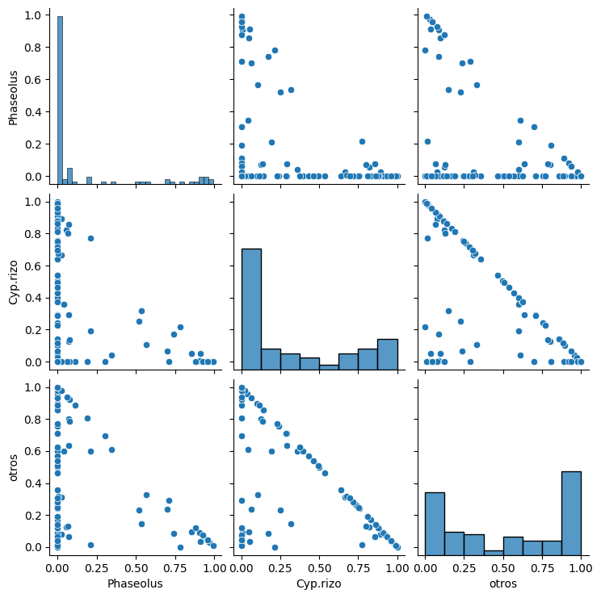
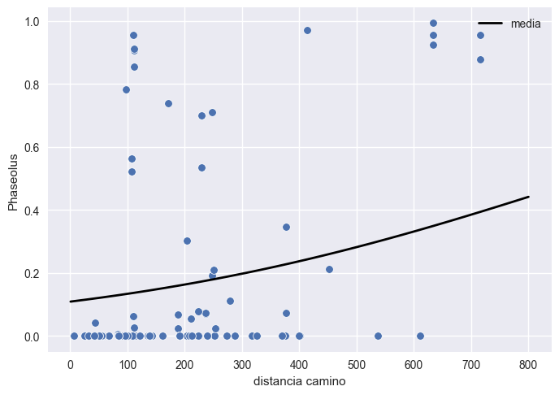

<p align="center">
  
</p>

# INFORME DE RESULTADOS 
## PROYECTO: ANÁLISIS ESTADÍSTICO DE FACTORES QUE DETERMINAN ABUNDANCIA, DIETA Y DISTRIBUCIÓN DE LA CODORNIZ MOCTEZUMA

<p align="right"> Hermosillo, Sonora, 1 de Junio de 2024 </p>

### Índice
1. Introducción 
2. Objetivos del análisis
3. Metodología
4. Hallazgos
5. Conclusiones
    

 
### Introducción

Este informe tiene como objetivo presentar un análisis estadístico del proyecto “Factores que contribuyen a la abundancia, dieta y distribución de las codornices de Norteamérica, específicamente la codorniz Moctezuma (Cyrtonyx montezumae)”. La conservación de esta especie representa un desafío debido a la disminución de sus poblaciones. Los cambios climáticos y la pérdida de hábitat pueden afectar negativamente la disponibilidad y calidad de los alimentos, especialmente en zonas áridas donde estos pueden ser escasos.

Es crucial, por tanto, los hallazgos estadísticos obtenidos, ya que nos permiten explicar la situación actual de la codorniz Moctezuma y comprender mejor la significancia de las variables involucradas, particularmente las relacionadas con la alimentación. Este análisis tiene como finalidad determinar la importancia de cada uno de los elementos presentes en la dieta de la especie.

Nos basamos en la información recopilada por el doctorante Oscar Enrique López Bujanda para su tesis, obtenida mediante observaciones e interacciones directas con la codorniz. En una primera instancia, se realizó una revisión del marco teórico, seguida de la limpieza y análisis exploratorio de los datos proporcionados por el doctorante. A partir de este análisis inicial, se desarrolló un análisis estadístico descriptivo detallado.

### Objetivos del análisis  

- **_Revisión del documento teórico y del trabajo de investigación:_** Analizamos exhaustivamente el documento proporcionado, que contiene el marco teórico y la investigación previa sobre la codorniz Moctezuma. Esto incluye una evaluación crítica de las teorías, hipótesis y estudios anteriores que garantizr una comprensión sólida del contexto y los antecedentes del proyecto.

- **_Revisión exploratoria de los datos de las cosechas de la codorniz:_** Realizamos una inspección inicial de los datos proporcionados en el archivo Excel, que contiene información sobre las cosechas de la codorniz Moctezuma. Esta revisión se enfoco en identificar la calidad de los datos, detectar valores atípicos y entender la estructura básica de la información recolectada.

- **_Conceptualización y análisis estadístico general:_** Desarrollamos un plan de análisis estadístico que incluya la definición de las hipótesis, la selección de métodos estadísticos adecuados y la estructuración del proceso analítico. Este objetivo busco establecer una base sólida para el análisis estadístico general, asegurando que se aborden todas las variables relevantes.

- **_Diseño y construcción de un análisis exploratorio de datos detallado:_** Implementamos un análisis exploratorio de datos (EDA) para obtener una comprensión profunda de las relaciones y patrones en los datos. Este análisis incluyo visualizaciones y estadísticas descriptivas para explorar las tendencias y correlaciones iniciales, proporcionando una base para análisis más complejos.

- **_Análisis multivariado para identificar relaciones entre la dieta de la codorniz y variables climáticas y ambientales:_** Realizamos un análisis multivariado avanzado para identificar cómo la dieta de la codorniz Moctezuma se relaciona con variables intrínsecas de la especie, así como con factores climáticos y ambientales. Este análisis busco entender las interacciones y dependencias entre múltiples variables, utilizando técnicas como la regresión múltiple, el análisis de componentes principales y el análisis de clústeres.

#### Justificación  

La realización de un análisis estadístico detallado sobre los factores que contribuyen a la abundancia, dieta y distribución de la codorniz Moctezuma (Cyrtonyx montezumae) es crucial debido a las siguientes razones técnicas y científicas:

1. **_Identificación de Variables Clave:_** La estadística permite identificar y cuantificar las variables clave que afectan a la codorniz Moctezuma. Mediante técnicas como el análisis exploratorio de datos (EDA) y análisis multivariado, podemos determinar qué factores tienen un impacto significativo en la abundancia y distribución de la especie, así como en su dieta.

2. **_Validación de Hipótesis:_** A través de pruebas estadísticas, es posible validar o refutar hipótesis específicas relacionadas con los efectos del cambio climático y la pérdida de hábitat en la disponibilidad y calidad de los alimentos. Esto proporciona una base científica sólida para las conclusiones y recomendaciones del proyecto.

3. **_Reducción de Incertidumbre:_** El uso de métodos estadísticos avanzados permite reducir la incertidumbre asociada con la variabilidad de los datos. Técnicas como la regresión múltiple, análisis de componentes principales y análisis de clústeres ayudan a extraer patrones claros y significativos, facilitando una mejor comprensión de las relaciones entre las variables estudiadas.

4. **_Optimización de Recursos de Conservación:_** La identificación de los elementos más significativos en la dieta de la codorniz Moctezuma mediante análisis estadísticos precisos permite optimizar los recursos destinados a su conservación. Al focalizar los esfuerzos en los factores más influyentes, se puede maximizar el impacto positivo de las medidas de conservación.

5. **_Base Empírica para la Toma de Decisiones:_** La información recopilada por el doctorante Oscar Enrique López Bujanda, basada en observaciones e interacciones directas con la codorniz, proporciona datos empíricos esenciales para el análisis. El tratamiento estadístico de estos datos permite convertir observaciones cualitativas en conclusiones cuantitativas y objetivas, fundamentando la toma de decisiones en evidencia científica.

6. **_Desarrollo Metodológico Riguros:_** El proyecto incluye una revisión exhaustiva del marco teórico, seguida de una limpieza y análisis exploratorio de los datos. Estos pasos iniciales son fundamentales para garantizar la calidad y la integridad de los datos, lo que a su vez es crucial para el éxito de los análisis estadísticos posteriores. El análisis descriptivo y el análisis multivariado se desarrollaron con rigor metodológico, asegurando que los resultados sean fiables y reproducibles.

7. **_Relevancia en el Contexto de Cambio Climático:_** La aplicación de técnicas estadísticas avanzadas permite evaluar cómo variables climáticas y ambientales específicas afectan la dieta y distribución de la codorniz Moctezuma. Esta evaluación es esencial en el contexto actual de cambio climático, donde la precisión y robustez de los análisis son vitales para desarrollar estrategias de mitigación y adaptación efectivas.

En resumen, el desarrollo de este proyecto estadístico está justificado por la necesidad de comprender profundamente los factores que afectan la supervivencia de la codorniz Moctezuma. Las técnicas estadísticas aplicadas no solo proporcionan una comprensión detallada de las variables involucradas, sino que también ofrecen una base sólida para la toma de decisiones informadas y efectivas en términos de conservación. La rigurosidad y precisión de estos análisis aseguran que los hallazgos del proyecto sean válidos y útiles para abordar los desafíos actuales de conservación de esta especie.

### Metodología

#### Datos  

Los datos fueron proporcionados en un archivo Excel que contenía una serie de variables relacionadas con la cosecha de las codornices, tanto en el estado de Nuevo México como en Arizona, Estados Unidos. Este archivo incluye un total de 319 registros y 145 variables, conformando así los datos en bruto.

Las variables iniciales con las que se comenzó a trabajar son las siguientes:

<table>
  <tr>
    <td>edad</td>
    <td>sexo</td>
    <td>estado</td>
    <td>peso total</td>
  </tr>
  <tr>
    <td>Oxalis</td>
    <td>Quercus</td>
    <td>Cyp.bulb</td>
    <td>Phaseolus</td>
  </tr>
  <tr>
    <td>Tephoria</td>
    <td>Caracoles</td>
    <td>Insectos</td>
    <td>Physalis</td>
  </tr>
  <tr>
    <td>Vitis.arizonica</td>
    <td>Lupinus</td>
    <td>Lotus.wrightii</td>
    <td>Cyp.rizo</td>
  </tr>
  <tr>
    <td>Commelina.dianthifolia</td>
    <td>Kallstroemia.parviflora</td>
    <td>Fabacea</td>
    <td>Ipomoea</td>
  </tr>
  <tr>
    <td>Desmodium</td>
    <td>Euphorbia probably E. bilobata</td>
    <td>Talinum.aurantiacum</td>
    <td>SP17</td>
  </tr>
  <tr>
    <td>Heterosperma.pinnatum</td>
    <td>SP19</td>
    <td>Desmanthus cooleyi</td>
    <td>Celtis.reticulata</td>
  </tr>
  <tr>
    <td>Panicum.hirticaule</td>
    <td>Setaria</td>
    <td>Malvacea</td>
    <td>Cyperus.fendlerianus</td>
  </tr>
  <tr>
    <td>SP26</td>
    <td>Setaria.1</td>
    <td>SP28</td>
    <td>Cryptantha.cinerea</td>
  </tr>
  <tr>
    <td>Sphaeralcea.fendleri</td>
    <td>Hymenopappus.flavescens</td>
    <td>Solaneaceae</td>
    <td>Euphorbia</td>
  </tr>
  <tr>
    <td>SP34</td>
    <td>Piptochaetium.fimbriatum</td>
    <td>Acalypha.neomexiacana</td>
    <td>Fabaceae</td>
  </tr>
  <tr>
    <td>Lupinus.neomexicanus</td>
    <td>Mirabilis.longiflora</td>
    <td>SP44</td>
    <td>Prunus.virginiana</td>
  </tr>
  <tr>
    <td>SP46</td>
    <td>Urochloa</td>
    <td>Cyperaceae</td>
    <td>Pinus.edulis</td>
  </tr>
  <tr>
    <td>Fabacea.1</td>
    <td>SP51</td>
    <td>SP52</td>
    <td>Calliandra.humilis</td>
  </tr>
  <tr>
    <td>Fabaceae.1</td>
    <td>Solanum</td>
    <td>Calliandra.eriophylla</td>
    <td>Desmanthus.cooleyi</td>
  </tr>
  <tr>
    <td>Sp59</td>
    <td>Croton.pottsii</td>
    <td>Lupinus.1</td>
    <td>Polygonaceae</td>
  </tr>
  <tr>
    <td>Euphorbia.1</td>
    <td>Calliandra</td>
    <td>Solanum.1</td>
    <td>SPA1</td>
  </tr>
  <tr>
    <td>SPA2</td>
    <td>Lotus</td>
    <td>Bidens.leptocephala</td>
    <td>SPA5</td>
  </tr>
  <tr>
    <td>SPA6</td>
    <td>Tephrosia</td>
    <td>Asteraceae.Uropappus lindleyi</td>
    <td>SPA9</td>
  </tr>
  <tr>
    <td>SPA10</td>
    <td>Ziziphus.obtisufolia</td>
    <td>Aristida</td>
    <td>Diodia.teres</td>
  </tr>
  <tr>
    <td>Bothriochloa</td>
    <td>Pinus.dulis</td>
    <td>Paspalum.distichum</td>
    <td>SPA17</td>
  </tr>
  <tr>
    <td>SPA18</td>
    <td>SPA19</td>
    <td>Euphorbia.exstipulata</td>
    <td>SPA21</td>
  </tr>
  <tr>
    <td>Asteracea</td>
    <td>SPA23</td>
    <td>SPA24</td>
    <td>Chilopsis.linearis</td>
  </tr>
  <tr>
    <td>Sorghum.halepense</td>
    <td>Amaranthus</td>
    <td>Setaria nigricans</td>
    <td>SPA29</td>
  </tr>
  <tr>
    <td>SPA30</td>
    <td>SPA31</td>
    <td>SPA32</td>
    <td>SPA33</td>
  </tr>
  <tr>
    <td>SPA34</td>
    <td>SPA35</td>
    <td>SPA36</td>
    <td>SPA37</td>
  </tr>
  <tr>
    <td>SPA38</td>
    <td>SPA39</td>
    <td>SPA40</td>
    <td>Agave.or.Yucca</td>
  </tr>
  <tr>
    <td>SPA42</td>
    <td>SPA43</td>
    <td>SPA44</td>
    <td>Sida</td>
  </tr>
  <tr>
    <td>SPA46</td>
    <td>SPA47</td>
    <td>Tragia</td>
    <td>Lupinus.2</td>
  </tr>
  <tr>
    <td>SPA50</td>
    <td>SPA51</td>
    <td>SPA52</td>
    <td>SPA53</td>
  </tr>
  <tr>
    <td>SPA54</td>
    <td>SPA55</td>
    <td>Amaranthus.1</td>
    <td>Desmodium.1</td>
  </tr>
  <tr>
    <td>Bothriochloa.1</td>
    <td>Euphorbia.2</td>
    <td>SPA60</td>
    <td>SPA61</td>
  </tr>
  <tr>
    <td>SPA62</td>
    <td>Phaseolus.1</td>
    <td>SPA64</td>
    <td>SPA65</td>
  </tr>
  <tr>
    <td>Arachnida</td>
    <td>Juniperus prob. deppeana</td>
    <td>time</td>
    <td>covey</td>
  </tr>
  <tr>
    <td>dist camino</td>
    <td>ppanual17</td>
    <td>tmedia17</td>
    <td>altitud</td>
  </tr>
  <tr>
    <td>lat</td>
    <td>lon</td>
    <td>hcrop</td>
    <td>hland</td>
  </tr>
  <tr>
    <td>gap</td>
    <td></td>
    <td></td>
    <td></td>
  </tr>
</table>

El diccionario de datos es el siguiente (información proporcionada por Oscar)  

<table>
  <tr>
    <th>Variable</th>
    <th>Descripción</th>
  </tr>
  <tr>
    <td>Sexo</td>
    <td>J : juvenil, A : Adulto</td>
  </tr>
  <tr>
    <td>Female</td>
    <td>hembra, Male = macho</td>
  </tr>
  <tr>
    <td>Estado</td>
    <td>AZ : Arizona, NM : Nuevo México</td>
  </tr>
  <tr>
    <td>Peso total</td>
    <td>Peso total del buche del individuo</td>
  </tr>
  <tr>
    <td>Dieta</td>
    <td>Desde la variable Oxalis hasta la variable Juniperus prob. deppeana, los cuales representan el peso por ítem que consumió cada individuo.</td>
  </tr>
  <tr>
    <td>Time</td>
    <td>Hora en que se cazó o colectó el individuo</td>
  </tr>
  <tr>
    <td>covey</td>
    <td>Número total de individuos del grupo donde se colectó al individuo</td>
  </tr>
  <tr>
    <td>dist camino</td>
    <td>Distancia al camino más cercano</td>
  </tr>
  <tr>
    <td>ppanual17</td>
    <td>Precipitación media anual</td>
  </tr>
  <tr>
    <td>tmedia17</td>
    <td>Temperatura media</td>
  </tr>
  <tr>
    <td>altitud</td>
    <td>Elevación</td>
  </tr>
  <tr>
    <td>lat</td>
    <td>Latitud</td>
  </tr>
  <tr>
    <td>lon</td>
    <td>Longitud</td>
  </tr>
  <tr>
    <td>hcrop</td>
    <td>Diversidad de especies en el buche</td>
  </tr>
  <tr>
    <td>hland</td>
    <td>Diversidad del paisaje donde se cosechó a la codorniz</td>
  </tr>
  <tr>
    <td>gap</td>
    <td>Tipo de vegetación donde se cosechó a la codorniz</td>
  </tr>
</table>

#### Tratamiento de los Datos  

Una vez realizado el análisis exploratorio de los datos (EDA), obtuvimos información crucial sobre la calidad y el comportamiento de los datos crudos frente a análisis estadísticos preliminares. Este proceso nos permitió identificar la magnitud del tratamiento necesario para preparar los datos para los análisis subsecuentes. Aquí se detalla el tratamiento de los datos realizado:  
1.	**_Eliminación de registros duplicados:_**  
  •	Se identificaron y eliminaron registros duplicados, resultando en un total de 318 registros únicos y 145 variables. Esto ayudó a asegurar que cada observación fuera única, evitando sesgos en el análisis.
2.	**_Homologación de la clase 'sexo':_**  
  •	Se estandarizaron las categorías de la variable 'sexo', quedando únicamente como 'Female' y 'Male'. Esta unificación facilitó los análisis posteriores y mejoró la consistencia de los datos.
3.	**_Eliminación de columnas con desviación estándar igual a cero:_**  
  •	Se eliminaron las columnas que no presentaban variabilidad (desviación estándar igual a cero), resultando en 318 registros y 141 variables. Esta reducción de variables eliminó datos redundantes y simplificó el conjunto de datos.
4.	**_Manejo de valores faltantes:_**  
  •	Se eliminaron todos los registros que contenían valores faltantes en alguna de sus variables. Esto nos dejó con 182 registros completos y 141 variables, asegurando que los análisis estadísticos se basaran en datos completos y precisos.
5.	**_Escalamiento de datos numéricos:_**  
  •	Se procedió a escalar los datos numéricos para normalizar el rango de las variables. Este paso es crucial para que los algoritmos de aprendizaje automático y análisis multivariado funcionen correctamente y no se vean influenciados desproporcionadamente por variables con rangos más amplios.
6.	**_Codificación de variables categóricas:_**  
  •	Las variables categóricas como edad, sexo, estado, gap y time fueron codificadas para que pudieran ser utilizadas en los modelos estadísticos. Esta transformación permite que las variables categóricas se incluyan en análisis estadísticos.  

El tratamiento de los datos nos permitió limpiar y preparar el conjunto de datos para un análisis estadístico más preciso y sin ruido. Aunque el número de registros se redujo significativamente, esta reducción no impidió la realización de un análisis robusto. La limpieza y preprocesamiento de los datos son pasos críticos que aseguran la calidad y fiabilidad de los resultados obtenidos en el análisis estadístico posterior.


#### Métodos estadísticos  

1. **_Análisis exploratorio de datos (EDA):_** Este método fue fundamental al inicio del proyecto para comprender la estructura de los datos recopilados sobre la dieta y la distribución de la codorniz Moctezuma. Se utilizarón gráficos y estadísticas descriptivas para explorar las tendencias en la dieta, la variabilidad en la distribución geográfica de las codornices y cualquier posible correlación entre las variables.

2. **_Pruebas de hipótesis (incluyendo la prueba de normalidad como Shapiro-Wilk):_** Las pruebas de hipótesis fuerón esenciales para evaluar las afirmaciones sobre la relación entre las variables y para determinar si las diferencias observadas son estadísticamente significativas. Realizando pruebas para evaluar si hay diferencias significativas en la dieta de la codorniz entre diferentes regiones geográficas o entre diferentes grupos de edad y la correlación entre las distintas variables de dieta con las demas.

3. **_Análisis de correlación de Spearman:_** Este método se utilizo para explorar la relación entre variables que no siguen una distribución normal o que están relacionadas de manera no lineal. Examinando la correlación entre el peso total en el buche de la codorniz y la diversidad del paisaje donde se cosechó, el tiempo, la distancia en el camino, con los distintos indices de la dieta, variables de temperatura y precipitación, entre otras relaciones que nos pudieran ayudar a enteder mejor los datos, utilizando la correlación de Spearman para tener en cuenta posibles relaciones no lineales.

4. **_Análisis de componentes principales (PCA):_** PCA usado para reducir la dimensionalidad de los datos y identificar patrones latentes en la dieta y la distribución de la codorniz. Ayudando a identificar variables importantes que explican la mayor parte de la variabilidad en los datos y a visualizar la estructura subyacente de los mismos.

5. **_Modelo Random Forest:_** Este método de aprendizaje automático se utilizo en un intento por explicar cuáles serían las variables que afectan al índice de diversidad de alimentos (hcrop) que se encuentran en el buche de las codornices.

6. **_Distribución de Dirichlet:_** Esta distribución la utilizamos para modelar la proporción de diferentes elementos en la dieta de la codorniz Moctezuma. Modelando la proporción de diferentes tipos de alimentos consumidos por las codornices en diferentes regiones geográficas utilizando la distribución de Dirichlet.

#### Software  
- **_Lenguaje R y RStudio:_** Utilizamos el lenguaje R junto con RStudio para realizar análisis estadísticos avanzados. Aplicamos la distribución Dirichlet para modelar las proporciones de diferentes elementos en la dieta de la codorniz Moctezuma y efectuamos pruebas de hipótesis para determinar la significancia estadística de las variables. Estas técnicas nos permitieron validar nuestras hipótesis sobre los factores que influyen en la abundancia y distribución de la especie.

- **_Lenguaje Python:_** Empleamos Python para llevar a cabo el análisis exploratorio de datos (EDA) y el análisis estadístico inicial. Python fue fundamental para la limpieza y transformación de los datos, asegurando su calidad antes de los análisis multivariados. Implementamos técnicas como la regresión múltiple y el análisis de componentes principales (PCA) para identificar relaciones clave entre la dieta de la codorniz y las variables ambientales, climáticas y específicas de la especie. Python también facilitó un enfoque integral para el análisis, integrando diversas metodologías estadísticas y de visualización de datos.

- **_Librerías para Python:_** Utilizamos una variedad de librerías para potenciar nuestro análisis:

  -  **_Pandas:_** Para la manipulación y análisis de estructuras de datos.
  -  **_NumPy:_** Para el soporte de operaciones matemáticas y matrices.
  -  **_Matplotlib y Seaborn:_** Para la visualización de datos, permitiendo crear gráficos informativos y estéticamente agradables.
  -  **_Scikit-learn (sklearn):_** Para el análisis estadístico multivariado y técnicas de machine learning.
  -  **_Ydata_profiling:_** Para la creación de informes detallados de los datos, facilitando el EDA.
  -  **_Plotly:_** Para la creación de gráficos interactivos y visualizaciones avanzadas.

  Estas librerías nos proporcionaron las herramientas necesarias para realizar análisis estadísticos profundos y visualizaciones claras, mejorando la comprensión y comunicación de los hallazgos del proyecto.

-  **_Markdown:_** Utilizamos Markdown para la creación de los diferentes documentos del proyecto, incluyendo informes técnicos, documentación del código y presentaciones. Markdown nos permitió estructurar los documentos de manera clara y profesional, facilitando la comunicación de los resultados y metodologías a través de plataformas colaborativas como GitHub.

- **_GitHub:_** Albergamos el repositorio del proyecto en GitHub, donde versionamos todo el código, datos y documentación. GitHub nos proporcionó un entorno colaborativo eficiente, permitiendo un control de versiones riguroso y una administración efectiva del proyecto. Además, facilitó la colaboración y revisión del trabajo por parte de diferentes miembros del equipo.

- **_Visual Studio Code:_** Utilizamos Visual Studio Code como nuestro entorno de desarrollo integrado (IDE) principal. VS Code nos ofreció un conjunto de herramientas y extensiones que mejoraron nuestra productividad, permitiendo una edición de código eficiente, depuración, y la integración con sistemas de control de versiones como Git y plataformas colaborativas como GitHub.


### Hallazgos

A continuación se enlistan los hallazgos encontrados dentro del análisis:

- Los datos fueron analizados para identificar las principales categorías de alimentos consumidos por las codornices, como semillas, insectos, vegetación y otros. Se realizaron análisis estadísticos para detectar patrones y diferencias significativas en la dieta ya sea según la característica del ejemplar (macho o hembra, joven o adulto, numero de grupo, etc.) la fecha o la ubicación geográfica.
- Se encuentra envidencia estadística para rechazar que las variables utilizadas en el análisis provienen de una distribución normal, bajo la prueba de normalidad de Shapiro.  
- Bajo la prueba de hipótesis de correlación entre variables utilizando el coeficiente de Spearman, también se encuentra que son muy pocas las variables donde existe una correlación significativa, siendo (peso total - tiempo) la tupla más significativa. Para el resto, aunque algunas la evidencia no rechazaba la correlación, ésta era demasiado débil o se debía a una relación directa (como la temperatura con el hland).
- Se dividimos los tipos de alimentos consumidos por las codornices en dos métricas clave: el peso total de cada tipo de alimento y el número de individuos que consumieron cada tipo. Para obtener una medida precisa de la importancia relativa de cada tipo de alimento, primero sumamos el peso total de cada categoría alimenticia recolectada de los tractos digestivos de todas las codornices analizadas. Luego, contabilizamos el número de individuos que consumieron cada tipo de alimento. Esta doble aproximación nos permitió evaluar no solo la cantidad de cada tipo de alimento consumido en términos absolutos, sino también la frecuencia con que las codornices incorporaron cada tipo de alimento en su dieta, proporcionando una visión integral y detallada de sus hábitos alimenticios.

El 80% de los alimentos solo aparece en 9 de 319 individuas mientras que el 90% de los datos aparece en al menos 27 individuas. 
En cuanto al peso, solo el 90% de los datos tiene un peso mayor al 6.3 gramos contando todos los individuos.
Se tomara solo los alimentos cuyo peso total supera 18 gramos y que aparezcan mínimo en 50 individuos, aproximadamente los percentiles 90.

 <table>
    <thead>
        <tr>
            <th>Elemento</th>
            <th>Peso Total</th>
            <th>Conteo Total</th>
        </tr>
    </thead>
    <tbody>
        <tr>
            <td>Quercus</td>
            <td>124.52100</td>
            <td>91</td>
        </tr>
        <tr>
            <td>Cyp.bulb</td>
            <td>61.73510</td>
            <td>68</td>
        </tr>
        <tr>
            <td>Phaseolus</td>
            <td>101.80770</td>
            <td>114</td>
        </tr>
        <tr>
            <td>Insectos</td>
            <td>36.05154</td>
            <td>93</td>
        </tr>
        <tr>
            <td>Cyp.rizo</td>
            <td>163.39360</td>
            <td>154</td>
        </tr>
    </tbody>
</table>


#### Modelo lineal generalizado

En esta sección se busca modelar la distribución de la variable Y = [Oxalis, Quercus, Cyp.bulb, Phaseolus, Insectos, Cyp.rizo, Commelina.dianthifolia, Euphorbia probably E. bilobata, Piptochaetium.fimbriatum, Urochloa, otros] = $[y_1, ..., y_{11}]$ mediante una distribución de Dirichlet. Esta elección es adecuada debido a que las componentes de Y son proporciones que suman a 1, y la distribución de Dirichlet es ideal para modelar datos composicionales.

Al tener variables que influyen de manera indirecta en la distribucion de Y, se utilizará un modelo lineal generalizado (GLM) para modelar la distribución Y|X, donde X son las covariables a utilizar. Este enfoque permite capturar la relación entre las covariables y las componentes de Y dentro del marco de la distribución de Dirichlet.

El modelo matematico es el siguiente.
$$\mathbf{Y} \mid \mathbf{X} \sim \text{Dirichlet}(\boldsymbol{\alpha})$$
donde 
$$\alpha = (\alpha_1, \alpha_2, ...,\alpha_{11})$$
y

$$\log(\alpha_i) = \beta_{i0} + \beta_{i1}X_1 + \beta_{i2}X_2 + \ldots + \beta_{in}X_n \quad \text{para} \quad i = 1, \ldots, 11.$$

o más comunmente visto
$$\alpha_i = e^{\beta_{i,0} + \beta_{i,1}X_1 + \beta_{i,2}X_2 + ... + \beta_{i,n}X_n}$$

Dado que disponemos de una cantidad limitada de datos y que estos no parecen proceder de una misma población debido a la influencia de factores como el sexo, la edad y estado, se espera modelar solamente la distribución de Y y no tener un modelo predictorio con alta exactitud.

#### Regresion 1

En este primer analisis se toman las cobariables X = [time, dist.camino, covey, hland, ppanual17, tmedia17, altitud] y todos los registros que no tienen ninguno de estos datos como nulo.

```R
Warning message in DR_data(data[, c("Oxalis", "Quercus", "Cyp.bulb", "Phaseolus", :
“not all rows sum up to 1 => normalization forced
  some entries are 0 or 1 => transformation forced”
Call:
DirichReg(formula = Y ~ time + dist.camino + covey + hland + ppanual17 +
tmedia17 + altitud, data = data)

Standardized Residuals:
                                    Min       1Q   Median       3Q     Max
Oxalis                          -0.6073  -0.5260  -0.4958  -0.4600  5.6657
Quercus                         -0.6584  -0.5439  -0.5124  -0.4439  5.1968
Cyp.bulb                        -0.7573  -0.5967  -0.5511   0.0750  6.0917
Phaseolus                       -0.8016  -0.5686  -0.4820  -0.4386  7.2018
Insectos                        -0.6439  -0.5562  -0.5264  -0.4722  5.4155
Cyp.rizo                        -0.9426  -0.6904  -0.4523   2.8617  5.7115
Commelina.dianthifolia          -0.5683  -0.5166  -0.4961  -0.4770  4.0750
Euphorbia.probably.E..bilobata  -0.6067  -0.5265  -0.5007  -0.4653  4.6379
Piptochaetium.fimbriatum        -0.5485  -0.5059  -0.4889  -0.4720  6.1275
Urochloa                        -0.5541  -0.5022  -0.4824  -0.4693  4.3213
otros                           -0.9134  -0.6946  -0.5399  -0.0023  5.3205

------------------------------------------------------------------
Beta-Coefficients for variable no. 1: Oxalis
              Estimate Std. Error z value Pr(>|z|)
(Intercept)  1.116e+00  3.568e+00   0.313    0.755
time         2.328e-04  3.630e-04   0.641    0.521
dist.camino  9.957e-05  4.325e-04   0.230    0.818
covey        4.516e-03  1.990e-02   0.227    0.820
hland        3.498e-01  2.629e-01   1.330    0.183
ppanual17    2.250e-03  1.417e-03   1.588    0.112
tmedia17    -1.798e-01  1.423e-01  -1.263    0.206
altitud     -1.228e-03  1.145e-03  -1.072    0.284
------------------------------------------------------------------
Beta-Coefficients for variable no. 2: Quercus
              Estimate Std. Error z value Pr(>|z|)  
(Intercept) -7.3268884  3.7909944  -1.933   0.0533 .
time         0.0001418  0.0003549   0.399   0.6896  
dist.camino -0.0002656  0.0004520  -0.588   0.5568  
covey       -0.0177089  0.0205985  -0.860   0.3899  
hland       -0.2391517  0.2605668  -0.918   0.3587  
ppanual17    0.0010750  0.0015077   0.713   0.4758  
tmedia17     0.1986645  0.1480794   1.342   0.1797  
altitud      0.0015664  0.0012047   1.300   0.1935  
------------------------------------------------------------------
Beta-Coefficients for variable no. 3: Cyp.bulb
              Estimate Std. Error z value Pr(>|z|)
(Intercept)  4.4705266  3.7164250   1.203    0.229
time        -0.0001930  0.0003628  -0.532    0.595
dist.camino -0.0002903  0.0004077  -0.712    0.476
covey        0.0108314  0.0208043   0.521    0.603
hland        0.2021493  0.2635414   0.767    0.443
ppanual17   -0.0019545  0.0013963  -1.400    0.162
tmedia17    -0.1712334  0.1442321  -1.187    0.235
altitud     -0.0016474  0.0011566  -1.424    0.154
------------------------------------------------------------------
Beta-Coefficients for variable no. 4: Phaseolus
              Estimate Std. Error z value Pr(>|z|)   
(Intercept) -2.6947885  3.4742234  -0.776  0.43795   
time         0.0004526  0.0003557   1.272  0.20323   
dist.camino  0.0013492  0.0004679   2.883  0.00393 **
covey        0.0025143  0.0210682   0.119  0.90500   
hland        0.1542274  0.2435186   0.633  0.52652   
ppanual17    0.0016226  0.0013416   1.209  0.22649   
tmedia17     0.0089455  0.1357288   0.066  0.94745   
altitud     -0.0004569  0.0011205  -0.408  0.68344   
------------------------------------------------------------------
Beta-Coefficients for variable no. 5: Insectos
              Estimate Std. Error z value Pr(>|z|)  
(Intercept) -6.775e+00  3.684e+00  -1.839   0.0659 .
time         2.792e-04  3.570e-04   0.782   0.4342  
dist.camino  3.957e-05  4.269e-04   0.093   0.9261  
covey        5.001e-03  1.991e-02   0.251   0.8017  
hland       -1.102e-01  2.574e-01  -0.428   0.6687  
ppanual17   -1.577e-03  1.413e-03  -1.116   0.2643  
tmedia17     1.989e-01  1.454e-01   1.368   0.1713  
altitud      1.614e-03  1.170e-03   1.379   0.1679  
------------------------------------------------------------------
Beta-Coefficients for variable no. 6: Cyp.rizo
              Estimate Std. Error z value Pr(>|z|)   
(Intercept) -6.6012512  3.8141881  -1.731   0.0835 . 
time         0.0004447  0.0004098   1.085   0.2778   
dist.camino -0.0012522  0.0004276  -2.929   0.0034 **
covey        0.0037715  0.0201305   0.187   0.8514   
hland       -0.0556809  0.2636122  -0.211   0.8327   
ppanual17   -0.0014673  0.0013389  -1.096   0.2731   
tmedia17     0.1882543  0.1544122   1.219   0.2228   
altitud      0.0018780  0.0011940   1.573   0.1158   
------------------------------------------------------------------
Beta-Coefficients for variable no. 7: Commelina.dianthifolia
              Estimate Std. Error z value Pr(>|z|)
(Intercept) -4.616e+00  3.590e+00  -1.286    0.198
time        -3.592e-05  3.592e-04  -0.100    0.920
dist.camino -1.481e-05  4.204e-04  -0.035    0.972
covey       -6.333e-03  2.016e-02  -0.314    0.753
hland        7.094e-03  2.570e-01   0.028    0.978
ppanual17    5.138e-05  1.363e-03   0.038    0.970
tmedia17     1.056e-01  1.431e-01   0.737    0.461
altitud      8.579e-04  1.147e-03   0.748    0.455
------------------------------------------------------------------
Beta-Coefficients for variable no. 8: Euphorbia.probably.E..bilobata
              Estimate Std. Error z value Pr(>|z|)
(Intercept) -3.192e+00  3.781e+00  -0.844    0.398
time         3.960e-04  3.719e-04   1.065    0.287
dist.camino -1.521e-04  4.185e-04  -0.364    0.716
covey        8.533e-03  2.037e-02   0.419    0.675
hland       -3.307e-01  2.796e-01  -1.183    0.237
ppanual17    1.173e-04  1.359e-03   0.086    0.931
tmedia17     9.090e-02  1.501e-01   0.606    0.545
altitud     -5.565e-05  1.211e-03  -0.046    0.963
------------------------------------------------------------------
Beta-Coefficients for variable no. 9: Piptochaetium.fimbriatum
              Estimate Std. Error z value Pr(>|z|)
(Intercept) -2.283e+00  3.513e+00  -0.650    0.516
time         3.349e-05  3.619e-04   0.093    0.926
dist.camino -1.162e-04  4.302e-04  -0.270    0.787
covey        1.680e-02  2.088e-02   0.804    0.421
hland       -8.737e-02  2.529e-01  -0.345    0.730
ppanual17    6.059e-04  1.383e-03   0.438    0.661
tmedia17    -6.169e-03  1.380e-01  -0.045    0.964
altitud      1.165e-04  1.128e-03   0.103    0.918
------------------------------------------------------------------
Beta-Coefficients for variable no. 10: Urochloa
              Estimate Std. Error z value Pr(>|z|)
(Intercept) -1.334e-01  3.718e+00  -0.036    0.971
time        -3.958e-05  3.605e-04  -0.110    0.913
dist.camino -1.193e-04  4.290e-04  -0.278    0.781
covey       -1.082e-03  2.030e-02  -0.053    0.957
hland        2.956e-02  2.588e-01   0.114    0.909
ppanual17    5.082e-04  1.378e-03   0.369    0.712
tmedia17    -4.871e-02  1.463e-01  -0.333    0.739
altitud     -6.958e-04  1.190e-03  -0.584    0.559
------------------------------------------------------------------
Beta-Coefficients for variable no. 11: otros
              Estimate Std. Error z value Pr(>|z|)   
(Intercept)  3.8566129  3.9041723   0.988  0.32324   
time         0.0010726  0.0003633   2.953  0.00315 **
dist.camino -0.0002985  0.0004265  -0.700  0.48403   
covey        0.0252257  0.0192240   1.312  0.18945   
hland       -0.0962470  0.2518577  -0.382  0.70235   
ppanual17   -0.0001508  0.0014786  -0.102  0.91876   
tmedia17    -0.1977544  0.1534051  -1.289  0.19736   
altitud     -0.0021562  0.0012981  -1.661  0.09669 . 
------------------------------------------------------------------
Significance codes: 0 ‘***’ 0.001 ‘**’ 0.01 ‘*’ 0.05 ‘.’ 0.1 ‘ ’ 1

Log-likelihood: 6739 on 88 df (689 BFGS + 2 NR Iterations)
AIC: -13303, BIC: -13023
Number of Observations: 178
Link: Log
Parametrization: common
```
Los resultados no son muy alentadores, pues en la mayoria de los $\alpha_i$ los coeficientes son practicamente cero, salvo contadas excepciones para la variable distancia camino y tiempo.

## Regresion 2 Codornices Machos

Aquí se restringió la poblacion para machos adultos.

Se toman las cobariables X = [time, covey,  ppanual17, tmedia17, dist.camino] y todos los registros que no tienen ninguno de estos datos como nulo.

```R
Warning message in DR_data(data[, c("Oxalis", "Quercus", "Cyp.bulb", "Phaseolus", :
“not all rows sum up to 1 => normalization forced
  some entries are 0 or 1 => transformation forced”
Call:
DirichReg(formula = Y ~ time + covey + ppanual17 + tmedia17 + dist.camino, data
= data)

Standardized Residuals:
                                    Min       1Q   Median       3Q      Max
Oxalis                          -0.5568  -0.5353  -0.5278  -0.5161  -0.3523
Quercus                         -0.7341  -0.5614  -0.5326  -0.4987   3.6186
Cyp.bulb                        -0.7449  -0.5900  -0.5466  -0.4992   5.7684
Phaseolus                       -1.0018  -0.6901  -0.4861   0.7486   8.5053
Insectos                        -0.6838  -0.6302  -0.5800  -0.5160   7.0731
Cyp.rizo                        -1.2938  -0.7903  -0.0271   2.1273  16.7737
Commelina.dianthifolia          -0.5832  -0.5528  -0.5359  -0.5243   0.2081
Euphorbia.probably.E..bilobata  -0.6587  -0.5605  -0.5357  -0.4910   0.5440
Piptochaetium.fimbriatum        -0.5414  -0.5323  -0.5274  -0.5214  -0.4887
Urochloa                        -0.6698  -0.5851  -0.5128  -0.4893   4.2947
otros                           -1.3415  -0.7930  -0.5318   0.8575   3.4589

------------------------------------------------------------------
Beta-Coefficients for variable no. 1: Oxalis
              Estimate Std. Error z value Pr(>|z|)
(Intercept) -2.407e+00  1.865e+00  -1.291    0.197
time         9.861e-05  1.071e-03   0.092    0.927
covey        1.816e-02  5.384e-02   0.337    0.736
ppanual17    9.832e-04  3.219e-03   0.305    0.760
tmedia17     1.545e-02  1.068e-01   0.145    0.885
dist.camino  8.893e-05  9.025e-04   0.099    0.922
------------------------------------------------------------------
Beta-Coefficients for variable no. 2: Quercus
              Estimate Std. Error z value Pr(>|z|)
(Intercept) -1.826e+00  1.841e+00  -0.992    0.321
time        -6.206e-05  1.036e-03  -0.060    0.952
covey       -3.565e-02  5.816e-02  -0.613    0.540
ppanual17    3.607e-03  3.459e-03   1.043    0.297
tmedia17    -6.425e-02  1.127e-01  -0.570    0.568
dist.camino  7.319e-04  9.220e-04   0.794    0.427
------------------------------------------------------------------
Beta-Coefficients for variable no. 3: Cyp.bulb
              Estimate Std. Error z value Pr(>|z|)
(Intercept) -1.9255480  1.8559031  -1.038    0.299
time         0.0009069  0.0011212   0.809    0.419
covey       -0.0143265  0.0562414  -0.255    0.799
ppanual17    0.0005006  0.0030255   0.165    0.869
tmedia17    -0.0507891  0.1224192  -0.415    0.678
dist.camino -0.0001916  0.0008629  -0.222    0.824
------------------------------------------------------------------
Beta-Coefficients for variable no. 4: Phaseolus
             Estimate Std. Error z value Pr(>|z|)  
(Intercept) -2.701426   1.663727  -1.624   0.1044  
time        -0.001174   0.001029  -1.141   0.2538  
covey        0.008127   0.056115   0.145   0.8848  
ppanual17    0.002308   0.002544   0.907   0.3642  
tmedia17     0.126981   0.113335   1.120   0.2625  
dist.camino  0.002452   0.001103   2.222   0.0263 *
------------------------------------------------------------------
Beta-Coefficients for variable no. 5: Insectos
              Estimate Std. Error z value Pr(>|z|)
(Intercept) -1.273e+00  1.807e+00  -0.704    0.481
time         4.953e-05  1.037e-03   0.048    0.962
covey        3.141e-02  5.938e-02   0.529    0.597
ppanual17    2.652e-04  4.082e-03   0.065    0.948
tmedia17    -3.404e-02  1.207e-01  -0.282    0.778
dist.camino  2.942e-04  8.636e-04   0.341    0.733
------------------------------------------------------------------
Beta-Coefficients for variable no. 6: Cyp.rizo
              Estimate Std. Error z value Pr(>|z|)    
(Intercept) -1.066e+01  2.768e+00  -3.852 0.000117 ***
time         3.923e-03  1.724e-03   2.276 0.022864 *  
covey        2.027e-01  4.747e-02   4.269 1.97e-05 ***
ppanual17    1.457e-02  3.992e-03   3.650 0.000262 ***
tmedia17    -2.677e-01  9.652e-02  -2.773 0.005546 ** 
dist.camino  2.119e-03  9.786e-04   2.165 0.030391 *  
------------------------------------------------------------------
Beta-Coefficients for variable no. 7: Commelina.dianthifolia
              Estimate Std. Error z value Pr(>|z|)
(Intercept) -1.950e+00  1.810e+00  -1.077    0.281
time        -2.070e-05  1.065e-03  -0.019    0.984
covey        2.662e-02  5.261e-02   0.506    0.613
ppanual17    7.181e-04  3.181e-03   0.226    0.821
tmedia17     2.067e-03  1.039e-01   0.020    0.984
dist.camino  2.781e-05  8.854e-04   0.031    0.975
------------------------------------------------------------------
Beta-Coefficients for variable no. 8: Euphorbia.probably.E..bilobata
              Estimate Std. Error z value Pr(>|z|)
(Intercept) -1.960e+00  1.832e+00  -1.070    0.284
time        -5.582e-04  1.167e-03  -0.478    0.632
covey        6.434e-03  5.568e-02   0.116    0.908
ppanual17    5.891e-04  3.109e-03   0.189    0.850
tmedia17     7.884e-02  1.081e-01   0.730    0.466
dist.camino -8.888e-05  8.825e-04  -0.101    0.920
------------------------------------------------------------------
Beta-Coefficients for variable no. 9: Piptochaetium.fimbriatum
              Estimate Std. Error z value Pr(>|z|)
(Intercept) -2.143e+00  1.856e+00  -1.154    0.248
time         8.676e-05  1.086e-03   0.080    0.936
covey        1.520e-02  5.333e-02   0.285    0.776
ppanual17    9.939e-04  3.225e-03   0.308    0.758
tmedia17    -3.679e-03  1.060e-01  -0.035    0.972
dist.camino  1.788e-04  8.974e-04   0.199    0.842
------------------------------------------------------------------
Beta-Coefficients for variable no. 10: Urochloa
              Estimate Std. Error z value Pr(>|z|)
(Intercept) -2.3879982  1.7731582  -1.347    0.178
time        -0.0008420  0.0010990  -0.766    0.444
covey        0.0251113  0.0563125   0.446    0.656
ppanual17    0.0008530  0.0031245   0.273    0.785
tmedia17     0.1240074  0.1157006   1.072    0.284
dist.camino -0.0003574  0.0009243  -0.387    0.699
------------------------------------------------------------------
Beta-Coefficients for variable no. 11: otros
              Estimate Std. Error z value Pr(>|z|)  
(Intercept) -2.4936261  1.9729433  -1.264   0.2063  
time        -0.0004809  0.0012532  -0.384   0.7012  
covey        0.0344442  0.0551128   0.625   0.5320  
ppanual17   -0.0010881  0.0029355  -0.371   0.7109  
tmedia17     0.2153549  0.1089599   1.976   0.0481 *
dist.camino -0.0012637  0.0009229  -1.369   0.1709  
------------------------------------------------------------------
Significance codes: 0 ‘***’ 0.001 ‘**’ 0.01 ‘*’ 0.05 ‘.’ 0.1 ‘ ’ 1

Log-likelihood: 858.4 on 66 df (474 BFGS + 2 NR Iterations)
AIC: -1585, BIC: -1492
Number of Observations: 30
Link: Log
Parametrization: common
```

En este caso vemos que distancia camino fue significativa para Phaseolus y tmedia17, para Cyp.rizo todas fueron significativas pero en el caso de todas las demas no se obtiene ningun coeficiente que se diferencia de 0 de manera significativa.

Esto nos indica que los datos no siguen una distribución de dirichlet o, lo que pensamos nosotros, que las variables no son suficientes para generar este modelo.

## Regresion 3 Machos Jovenes  



En nuestra investigación, los elementos 'Phaseolus', 'Cyp.rizo' y 'otros' destacan por mostrar una relación notable en los datos recopilados. Esta observación significativa motivó su inclusión en el análisis detallado, ya que su presencia y características proporcionan información valiosa sobre los patrones de alimentación de las codornices en el área de estudio. La importancia de estos elementos radica en su contribución a la comprensión de las preferencias dietéticas y su influencia en el comportamiento alimentario de estas aves, lo cual es esencial para desarrollar estrategias de conservación y manejo de su hábitat.

Aunado a lo anterior, es importante destacar que el análisis se restringió a codornices jóvenes machos. Esta selección específica se justifica por la necesidad de reducir la variabilidad entre individuos y centrar el estudio en un grupo homogéneo, lo que permite una comparación más precisa y significativa de los hábitos alimenticios.

```R
Warning message in DR_data(data[, c("Phaseolus", "Cyp.rizo", "otros")]):
“some entries are 0 or 1 => transformation forced”
Call:
DirichReg(formula = Y ~ dist.camino | -1 + hcrop | -1 + covey, data = data)

Standardized Residuals:
               Min       1Q   Median       3Q     Max
Phaseolus  -1.2126  -0.6797  -0.5838  -0.5060  4.4081
Cyp.rizo   -1.7872  -1.1071  -0.5089   1.2584  3.4873
otros      -1.8729  -0.9630   0.3480   1.3522  2.4254

------------------------------------------------------------------
Beta-Coefficients for variable no. 1: Phaseolus
             Estimate Std. Error z value Pr(>|z|)    
(Intercept) -1.918277   0.199070  -9.636  < 2e-16 ***
dist.camino  0.002332   0.000753   3.097  0.00196 ** 
------------------------------------------------------------------
Beta-Coefficients for variable no. 2: Cyp.rizo
      Estimate Std. Error z value Pr(>|z|)    
hcrop  -1.3261     0.1753  -7.566 3.85e-14 ***
------------------------------------------------------------------
Beta-Coefficients for variable no. 3: otros
      Estimate Std. Error z value Pr(>|z|)   
covey -0.02902    0.01074  -2.702   0.0069 **
------------------------------------------------------------------
Significance codes: 0 ‘***’ 0.001 ‘**’ 0.01 ‘*’ 0.05 ‘.’ 0.1 ‘ ’ 1

Log-likelihood: 235 on 4 df (42 BFGS + 2 NR Iterations)
AIC: -462, BIC: -452.4
Number of Observations: 81
Link: Log
Parametrization: common
```
En este caso, se obtuvieron resultados significativos para todas las variables. Ahora podemos modelar el vector aleatorio $\mathbf{Y}$ de la siguiente manera:

$$ \mathbf{Y|X} = x\hspace{0.2cm} \sim Dir(\mathbf{\alpha}(x)) $$

Por consiguiente tenemos que las densidades marginales estan dadas de la siguiente manera

$$Y_i| \mathbb{X}  = x\hspace{0.2cm} \sim Beta(\alpha_i(x), \alpha_i(x) - \alpha_0 (x))$$

y por consiguiente podemos conocer su media

$$ \mathbb{E}[Y_i \mid \mathbf{X} = x] = \frac{\alpha_i(x)}{\alpha_0(x)} $$



El análisis de los datos revela que, a medida que las codornices Moctezuma se encuentran más lejos de los caminos, la proporción de 'Phaseolus' en su dieta aumenta significativamente. Esta observación sugiere que 'Phaseolus' es más abundante o accesible en áreas menos perturbadas por la presencia humana y la infraestructura. La lejanía de los caminos puede proporcionar un entorno más favorable para el crecimiento y la disponibilidad de 'Phaseolus', lo que resulta en un mayor consumo de esta planta por parte de las codornices. Este patrón indica que las codornices adaptan su dieta según la disponibilidad de recursos en su entorno, favoreciendo el consumo de 'Phaseolus' en áreas más remotas y naturales.


El análisis de los datos muestra que, a medida que las codornices Moctezuma tienen acceso a una mayor variedad de alimentos, su consumo de 'Cyp.rizo' disminuye notablemente. Esta tendencia sugiere que 'Cyp.rizo', aunque presente en su dieta, no es el alimento preferido cuando hay otras opciones disponibles. La diversidad alimentaria parece ofrecer alternativas más atractivas o nutritivas para las codornices, lo que reduce su dependencia de 'Cyp.rizo'. Este comportamiento refleja una estrategia adaptativa que permite a las codornices optimizar su ingesta nutricional y mejorar sus posibilidades de supervivencia al diversificar su dieta.


### Conclusiones

Los resultados mostraron que las codornices en Arizona y Nuevo México tienen una dieta altamente diversa, compuesta principalmente por semillas y pequeños invertebrados.

Se llevaron a cabo tres diferentes alternativas de análisis de alimento de codornices Moctezuma. Estas metodologías diversas se implementaron con el objetivo de obtener una visión integral y detallada de los hábitos alimenticios de esta especie, permitiendo así una comprensión más profunda de sus preferencias y comportamientos alimentarios.

### Recomendación

Para realizar un análisis exhaustivo de la variación del hábitat de la codorniz Moctezuma, es crucial disponer de datos detallados sobre variables climatológicas. Ya que estos datos permiten modelar los cambios en el hábitat y entender cómo las variaciones climáticas han afectado la conectividad y la disponibilidad de recursos para la codorniz Moctezuma a lo largo del tiempo.
Sin embargo, la recolección de datos presenta desafíos significativos. Las muestras de las codornices solo se obtienen durante la temporada de caza, lo cual introduce un sesgo temporal y posiblemente espacial en los datos. Esto significa que los datos pueden no ser representativos de todas las condiciones ambientales y de todas las épocas del año. Además, en el conjunto de datos disponible, solo se tiene acceso a la precipitación media anual y la temperatura media anual para los años en que se capturaron las codornices. 
Para mejorar la calidad del análisis, sería ideal complementar estos datos con información más detallada y de mayor resolución temporal.

